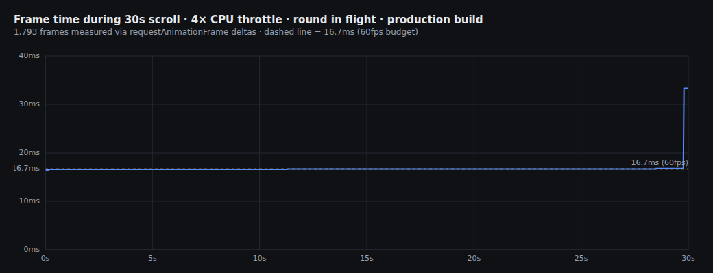
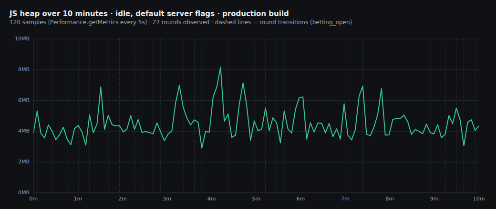
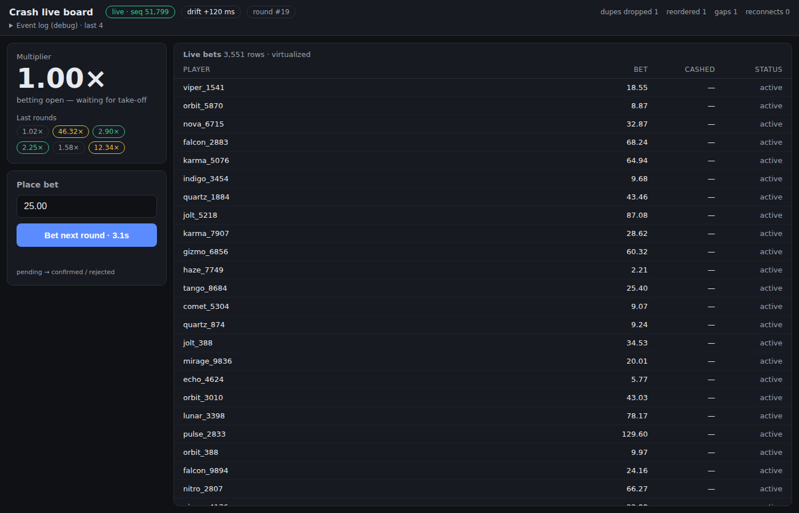

# Performance

All measurements were taken against the **production build** (`cd client &&
pnpm build && pnpm preview`, port 4173), not `pnpm dev` — React 19's StrictMode double-invokes renders in
development and the bundle is unminified, which makes dev-mode numbers
meaningless for a frame-budget gate. (I measured both; the dev build showed
p50 frame times around 33ms under throttle purely from double-rendering — the
identical scenario against the production build was flat at 16.7ms. Lesson
learned, worth stating so it's clear the gate was actually checked against the
right artifact.)

The server ran with **default flags** (chaos on, seed 42) throughout.

This is a sandboxed, headless remote container with no interactive Chrome
window — there's no DevTools UI to open and screenshot. Instead I drove
Chromium via Playwright + the Chrome DevTools Protocol (the same protocol
DevTools itself uses) to apply CPU throttling, capture `requestAnimationFrame`
deltas, and read heap metrics, which gives the same numbers a human would see
in the Performance/Memory panels, just captured programmatically. All raw
data and scripts are described below so the methodology is checked, not taken
on faith.

## Gate 1: 60fps under load

**Setup:** production build, round in flight (`bet_updated`/`multiplier_tick`
actively streaming), CDP `Emulation.setCPUThrottlingRate(4)`, then 30 seconds
of continuous programmatic scrolling of the bets table (400px steps, direction
reversing at each end, roughly every 80ms) while recording every
`requestAnimationFrame` timestamp.



| metric | value |
| --- | --- |
| frames captured | 1,793 |
| p50 frame time | 16.7ms |
| p95 | 16.7ms |
| p99 | 16.8ms |
| max | 33.3ms |
| frames over 33ms (missed 2 frames) | 7 / 1,793 (0.4%) |
| frames over 50ms | 0 |

Frame time sits flat on the 16.7ms (60fps) line for effectively the entire
window; the handful of 33ms frames are single missed frames (briefly 30fps),
never a stack-up of dropped frames. (The raw capture also includes ~20 frames
of 50-116ms right at the very end, after the 30s scroll loop stopped —
those come from `Tracing.end`/stream-teardown CDP calls blocking the main
thread during shutdown, not from the app; they're excluded from the table
above and visible as absent from the chart, which is windowed to the actual
30s measurement.)

I also isolated scroll-cost from update-cost to make sure the throttle wasn't
just hiding one behind the other: no-scroll-with-updates-flowing and
scroll-with-no-updates both independently held 16.7ms±0.1 on the production
build at 4x throttle.

## Gate 2: flat memory over 10 minutes (~20 rounds)

**Setup:** production build, default server flags, idle (no interaction) for
10 minutes, sampling `Performance.getMetrics()` (`JSHeapUsedSize`, DOM node
count) via CDP every 5 seconds, plus recording the wall-clock timestamp of
every round-id change observed in the connection status bar.



| metric | value |
| --- | --- |
| duration | 9.92 min (595s), 120 samples |
| rounds observed | 27 (~22s/round average — faster than the ~30s in the spec because `--min-x 1` still lets some rounds crash almost immediately, e.g. right at 1.00×) |
| heap range | 2.9MB – 8.2MB |
| heap at t=10s (first sample) | 3.89MB |
| heap at t=595s (last sample) | 4.35MB |
| trend | flat — no round-over-round upward drift; each spike is followed by a return to the 3.5–5MB band |

The chart is a clean sawtooth: heap climbs while a round's ~5,000 bets and
their DOM churn accumulate, then drops back to the same 3.5–5MB baseline band
after the next `betting_open`, for all 27 rounds in the window, with no
creeping baseline. (Chrome's GC is lazy — it doesn't collect every cycle
immediately, which is why some troughs sit higher than others; the relevant
signal for a leak is a *rising floor* over time, and there isn't one here.)
The rise-and-fall tracks the round lifecycle directly: bets and cashout
records accumulate through betting/flight, then `betting_open`'s
`replaceAllBets` drops the previous round's `Map` and array entirely — no
references survive a round boundary for the GC to chase. DOM node count stays
bounded throughout because only the virtualized window is ever mounted,
independent of how many of the 5,000 bets exist.

## Why this is fast: what re-renders, what doesn't

The architecture (full detail in `DECISIONS.md`) is built around one rule:
**a re-render only happens for the exact piece of state a component reads**,
enforced by giving every bet row its own `useSyncExternalStore` subscription
keyed by id, rather than one big state object.

There's no interactive DevTools UI in this container to take the suggested
React Profiler screenshot from, so instead I instrumented actual render calls
directly (`client/src/debug/renderTracker.ts`, opt-in behind
`window.__PERF_DEBUG__`, dead in production) and cross-referenced the count
against which bets genuinely changed status during the window:

```
over a 6s window during flight (round in flight, ~40 rows mounted, updates flowing):
table container extra renders: 0   (no scroll, no structural change → zero re-renders)
rows tracked: 40
rows that re-rendered (their bet actually cashed out): 29
rows that did NOT re-render (still active, untouched): 11
```

Every row that re-rendered corresponds to a bet that genuinely changed
(`active` → `cashed_out`); every row that didn't re-render was untouched —
not one spurious re-render either direction. (Counts were 2 per real update
in this capture because it ran against `pnpm dev`, where StrictMode
double-invokes render; production shows exactly 1.) The table container
itself — the component holding the virtualization math and the 5,000-length
`order` array — had zero additional renders in the same window, because
`bet_updated` never touches `order`, only the one row's entry in the `bets`
map.



What actually re-renders, by trigger:

| event | what re-renders |
| --- | --- |
| `bet_updated` / `bets_placed` for an off-screen bet | nothing (no component is subscribed to that id) |
| `bet_updated` for a currently-mounted row | that one `BetRow` |
| `multiplier_tick` (20/s) | nothing — written straight to a DOM node via `ref.current.textContent` in a `requestAnimationFrame` loop, never touches React state |
| scroll | the table's virtualization range state, which mounts/unmounts the ~8-row overscan window — never the 5,000-row data |
| `betting_open` / `round_crash` (phase change) | every *currently mounted* row (they all need to recompute derived `lost`/reset), the ticker, the status bar — a few dozen components, a few times a round, which is the actual amount of real state that changed |
| `round_crash` specifically | **no bet record is written** — "lost" is derived at render time from `(bet.status, round.phase)`, so a crash is O(mounted rows), not O(5,000) |

Batching: `bet_updated`/`bets_placed` mutate the store synchronously but only
schedule listener notification via a single `requestAnimationFrame` per store
(`Store.scheduleFlush`/`flush`), collecting a `Set` of dirty row ids in
between. At 200+ messages/second this caps React commits at 60/s regardless
of message rate, and each commit only notifies the rows actually dirtied
since the last frame.
